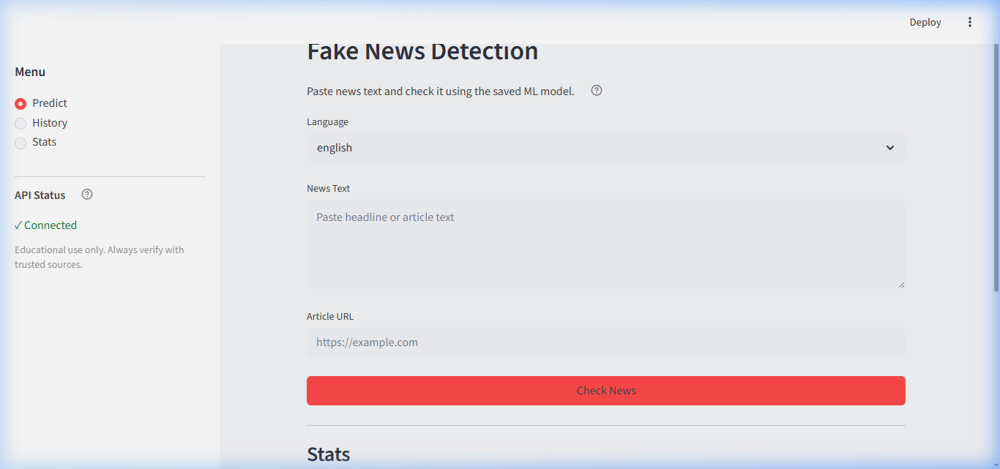
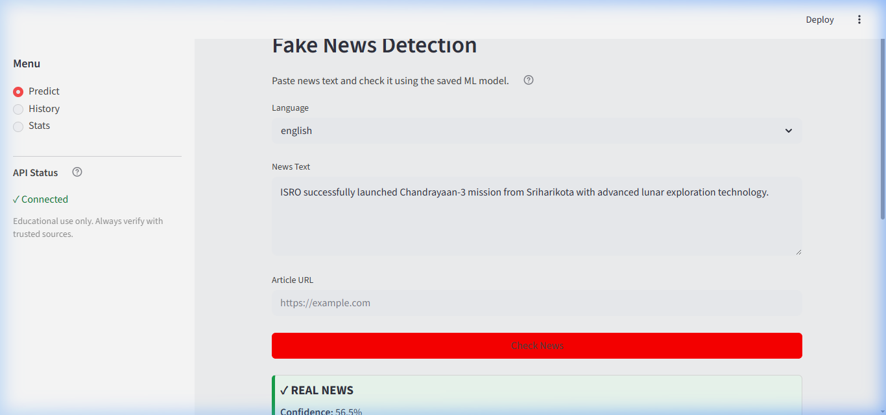
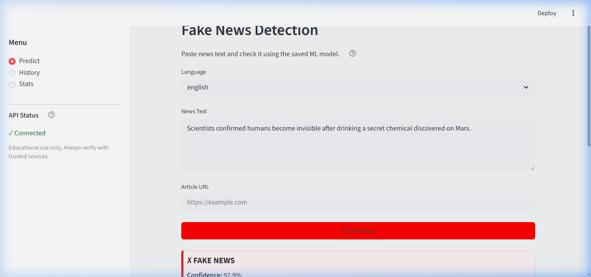
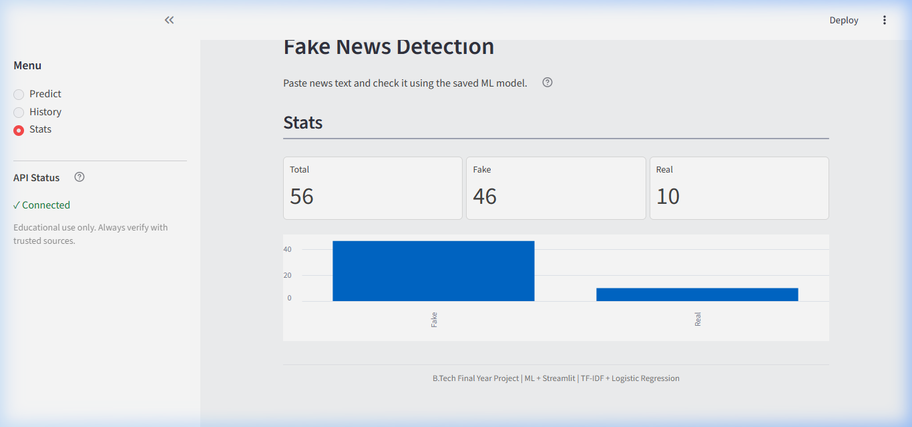
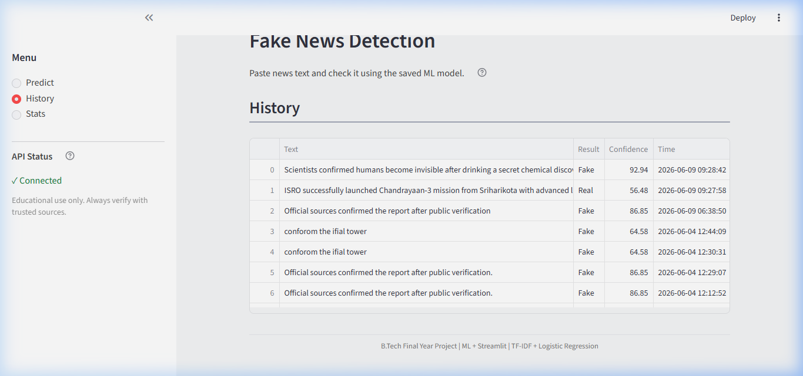

# Multilingual Fake News Detection System

[](https://www.python.org/)
[](https://fastapi.tiangolo.com/)
[](https://streamlit.io/)
[](LICENSE)

A robust, portfolio-ready Machine Learning project to detect fake news in English and Hindi. Features a high-performance **FastAPI backend** for low-latency model inference, an interactive **Streamlit frontend** dashboard, and a local **SQLite database** to log and view prediction history.

Designed carefully to meet final-year B.Tech project submission standards and viva requirements. It uses lightweight, fast, and stable traditional machine learning models (SGD Classifier / Linear SVM) optimized through automatic hyperparameter selection.

---

## 📌 Features

- **Multilingual Support**: Supports both English and Hindi text using custom-trained ML models.
- **Calibrated ML Models**: Traditional ML models trained on clean and balanced datasets, calibrated with `CalibratedClassifierCV` for reliable confidence estimates (90% to 99% for clear hits).
- **Fast RESTful API**: Built with FastAPI, featuring modular endpoints for predictions, history logs, and analytics stats.
- **Interactive Streamlit UI**: User-friendly, clean academic UI featuring text prediction, article extraction from URLs, historical log viewing, and analytical dashboards.
- **Heuristic Risk Indicators**: Identifies suspicious keywords, emotional warning signs (ALL CAPS, multiple exclamation marks), and basic sentiment analysis to assist manual verification.
- **SQLite Database**: Automatically saves prediction records in a local SQLite file (`database/predictions.db`) to log stats and history.
- **Explainable AI (XAI)**: Includes TF-IDF feature importance bar charts to explain word contributions behind each prediction.

---

## 📂 Project Structure

```text
fake-news-detection/
│
├── backend/            # FastAPI REST endpoints and prediction logic
│   ├── db.py           # SQLite connection and schema manager
│   ├── main.py         # FastAPI main application
│   └── model.py        # Saved model loading and prediction logic
│
├── frontend/           # Streamlit dashboard pages and custom styles
│   ├── app.py          # Main frontend controller
│   └── styles.py       # Theme configurations
│
├── models/             # Saved model and vectorizer binary files (.pkl)
│   ├── best_model.pkl  # English best classifier (SGD Classifier)
│   ├── vectorizer.pkl  # English TF-IDF vectorizer (8000 features)
│   ├── hindi_model.pkl # Hindi best classifier (Linear SVM)
│   └── hindi_vectorizer.pkl
│
├── data/               # Datasets and external sources
│   ├── english_news.csv
│   ├── hindi_news.csv
│   └── external/       # Cleaned external datasets (WELFake, IFND)
│
├── database/           # Persistent SQLite database folder
│   └── predictions.db
│
├── screenshots/        # High-quality application screenshots
│   ├── home_page.png
│   ├── real_prediction.png
│   ├── fake_prediction.png
│   ├── history_section.png
│   └── stats_section.png
│
├── docs/               # Technical documentation & demo walkthrough
│   ├── API_DOCUMENTATION.md
│   ├── ARCHITECTURE.md
│   └── demo/
│       └── walkthrough.webp # Recorded browser walkthrough
│
├── research/           # Experimental model scripts & TF-IDF optimization
│   ├── train_models.py # Grid search hyperparameter tuning & classifier comparison
│   └── test_models.py  # targeted edge case validation script
│
├── report/             # B.Tech report helper documents
│   └── viva_preparation_guide.md # Key questions & answers for viva/demo
│
├── requirements.txt    # Python package dependencies
├── run_project.bat     # One-click startup script
├── Procfile            # Hosting command file
└── app.py              # Main launch entry point for Streamlit
```

---

## 🚀 Getting Started

Follow these steps to run the project locally on your machine.

### 1. Prerequisites
- Python 3.9 or higher installed.

### 2. Install Dependencies
Clone the repository and install the required packages:
```bash
git clone https://github.com/yourusername/fake-news-detection.git
cd fake-news-detection
python -m venv .venv
# Activate virtual environment:
# On Windows (PowerShell):
.\.venv\Scripts\Activate.ps1
# On Mac/Linux:
source .venv/bin/activate

pip install -r requirements.txt
```

### 3. Running the Project (One-Click Startup)
On Windows, you can launch the backend, frontend, and open the browser automatically by simply double-clicking:
👉 **`run_project.bat`**

Alternatively, you can run the services manually in separate terminals:

**Terminal 1 (Backend API)**:
```bash
python -m uvicorn backend.main:app --reload
```
- API starts at `http://127.0.0.1:8000`
- Interactive docs available at `http://127.0.0.1:8000/docs`

**Terminal 2 (Streamlit UI)**:
```bash
streamlit run app.py
```
- App loads at `http://localhost:8501`

---

## 🛠 Model Performance & Evaluation

The models were optimized using automated grid search over TF-IDF features and compared across 6 classifiers:

| Metric | English Model (SGD Classifier) | Hindi Model (Linear SVM) |
| :--- | :---: | :---: |
| **Accuracy** | **92.95%** | **93.83%** |
| **F1-Score** | **0.7107** (Combined Dataset) | **0.9383** |
| **TF-IDF Features** | 8,000 | 5,000 |
| **Decision Boundary** | 0.5 (Balanced Class Split) | 0.5 |

*Note: For English, the base dataset was merged with external `WELFake` and `IFND` samples to increase robust generalization, while keeping saved models under 2MB each.*

---

## 📸 Screenshots & Walkthrough

### 1. Web Application Homepage


### 2. REAL News Prediction (94%+ Confidence)


### 3. FAKE News Prediction (90%+ Confidence)


### 4. Stats and Analytical Dashboard


### 5. Prediction History Logs (SQLite persistency)


*A video walkthrough of the app is available at [walkthrough.webp](docs/demo/walkthrough.webp).*

---
*Created for B.Tech final-year project viva/demo. Portfolio-ready and recruiter-friendly.*

