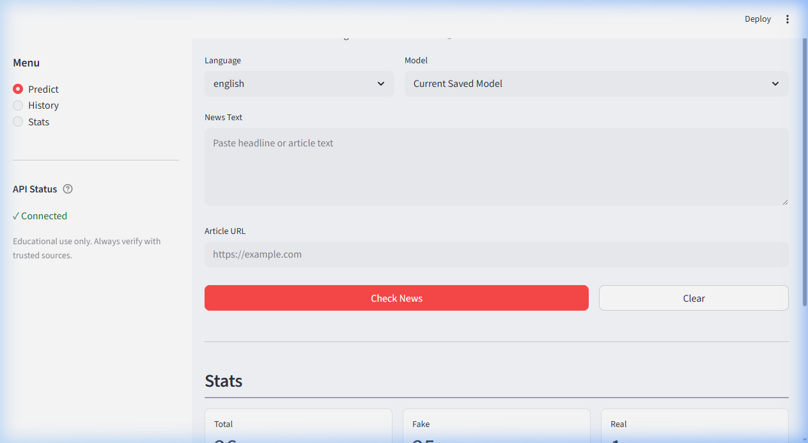
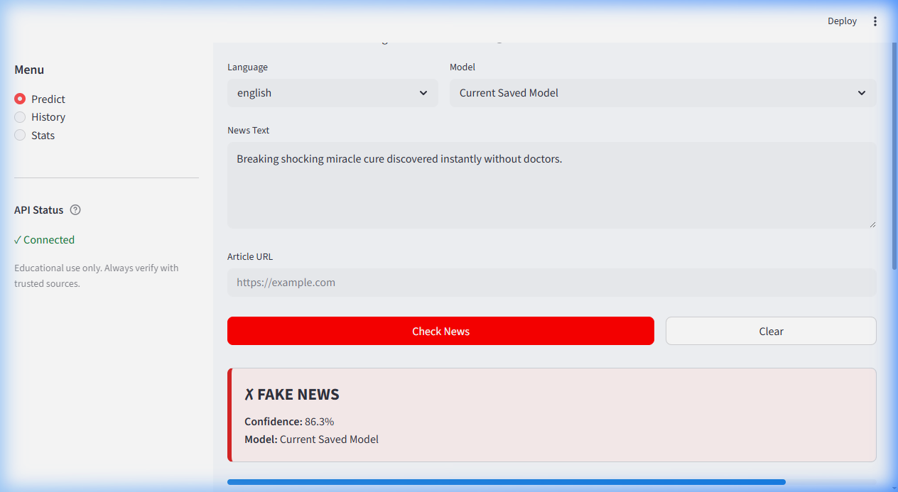
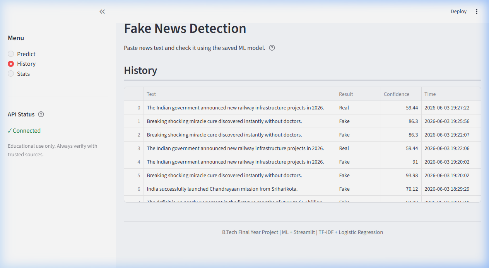

# Fake News Detection System Using Machine Learning



A comprehensive, end-to-end Machine Learning project to detect fake news using NLP (Natural Language Processing) and Logistic Regression. This project features a **FastAPI backend** for model inference and a **Streamlit frontend** for an interactive, user-friendly dashboard.

It is designed to be lightweight, easy to run locally, and ready for cloud deployment (e.g., Railway, Render).

---

## 📌 Features

- **Machine Learning Classification**: High-accuracy fake news detection using a custom-trained Logistic Regression model and TF-IDF vectorization.
- **RESTful API**: Fast and robust backend built with FastAPI.
- **Interactive UI**: Clean, professional web interface built with Streamlit.
- **Prediction History**: Local SQLite database integration to save and review past predictions.
- **Analytics Dashboard**: Visual statistics on the proportion of Real vs. Fake news scanned.
- **Multilingual Support**: Supports both English and Hindi news datasets.

---

## 📂 Project Structure

```
fake-news-detection/
├── backend/            # FastAPI server and ML prediction logic
├── frontend/           # Streamlit UI, styling, and API integration
├── models/             # Trained ML models (.pkl files)
├── data/               # Datasets (English & Hindi CSVs)
├── database/           # SQLite database for storing history
├── docs/               # API and Architecture documentation
├── src/                # Core ML preprocessing and training scripts
├── helpers/            # Utility scripts (Trust signals, XAI, URL extractors)
├── screenshots/        # Project screenshots for reports/presentations
├── app.py              # Streamlit launch wrapper
├── train_models.py     # Script to train/retrain ML models
├── requirements.txt    # Python dependencies
└── Procfile            # Deployment configuration for Railway/Heroku
```

---

## 🚀 Installation & Setup

Follow these simple steps to run the project locally on your machine.

### 1. Prerequisites
- Python 3.9 or higher installed on your system.
- Git (optional, for cloning the repository).

### 2. Clone the Repository
```bash
git clone https://github.com/yourusername/fake-news-detection.git
cd fake-news-detection
```

### 3. Create a Virtual Environment (Recommended)
```bash
python -m venv .venv
# Activate on Windows:
.venv\Scripts\activate
# Activate on Mac/Linux:
source .venv/bin/activate
```

### 4. Install Dependencies
```bash
pip install -r requirements.txt
```

---

## 💻 How to Run Locally

This project requires two terminals: one for the backend API and one for the frontend UI.

### Step 1: Start the Backend (FastAPI)
Open a terminal, activate your virtual environment, and run:
```bash
uvicorn backend.main:app --host 127.0.0.1 --port 8000
```
> The API will be available at `http://127.0.0.1:8000`
> You can view the API documentation at `http://127.0.0.1:8000/docs`

### Step 2: Start the Frontend (Streamlit)
Open a **second terminal**, activate your virtual environment, and run:
```bash
streamlit run app.py
```
> The web app will automatically open in your browser at `http://localhost:8501`

---

## ☁️ Deployment

This project is configured for seamless deployment on platforms like **Railway** or **Render**.

- **Procfile**: Tells the platform how to run the FastAPI backend (`web: uvicorn backend.main:app --host 0.0.0.0 --port $PORT`).
- **railway.json**: Specific configuration for Railway deployments.
- **runtime.txt**: Specifies the exact Python version required in production.

*(Note: The Streamlit frontend can be deployed separately via Streamlit Community Cloud using `app.py` as the entry point.)*

---

## 🛠 Architecture & Tech Stack

- **Frontend**: Streamlit, Python
- **Backend**: FastAPI, Uvicorn, Python
- **Database**: SQLite3
- **Machine Learning**: Scikit-Learn (Logistic Regression, TF-IDF), Pandas, NumPy
- **Natural Language Processing**: NLTK (Stopwords, Stemming)

For deeper technical details, see the [Architecture Documentation](docs/ARCHITECTURE.md) and [API Documentation](docs/API_DOCUMENTATION.md).

---

## 📸 Screenshots

| Prediction Result | History Dashboard |
|:---:|:---:|
|  |  |

---
*Created for academic/final-year project presentation.*
